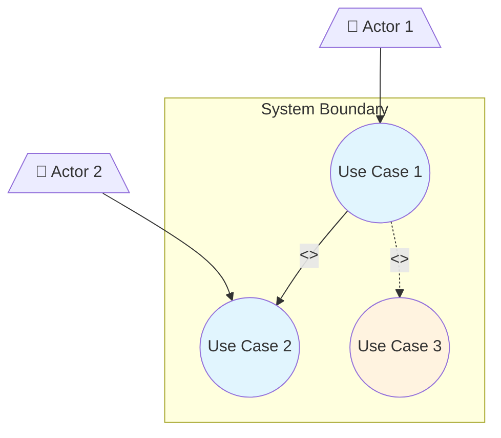
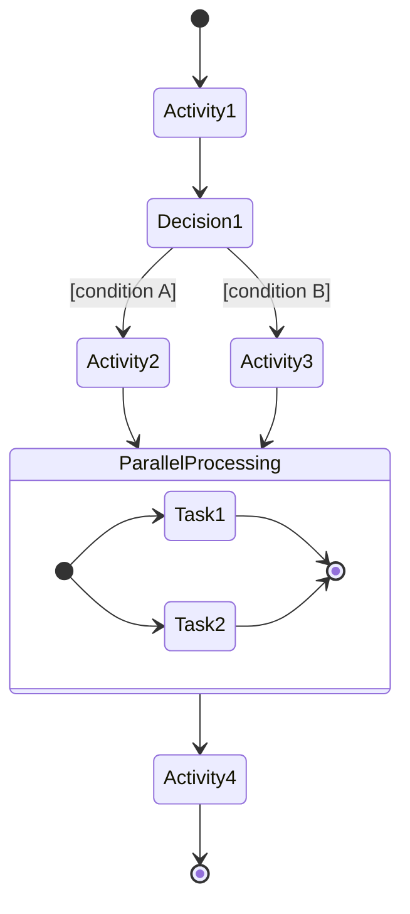
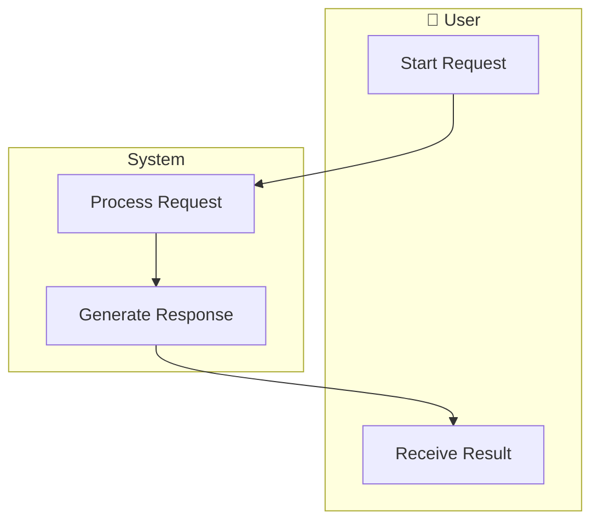
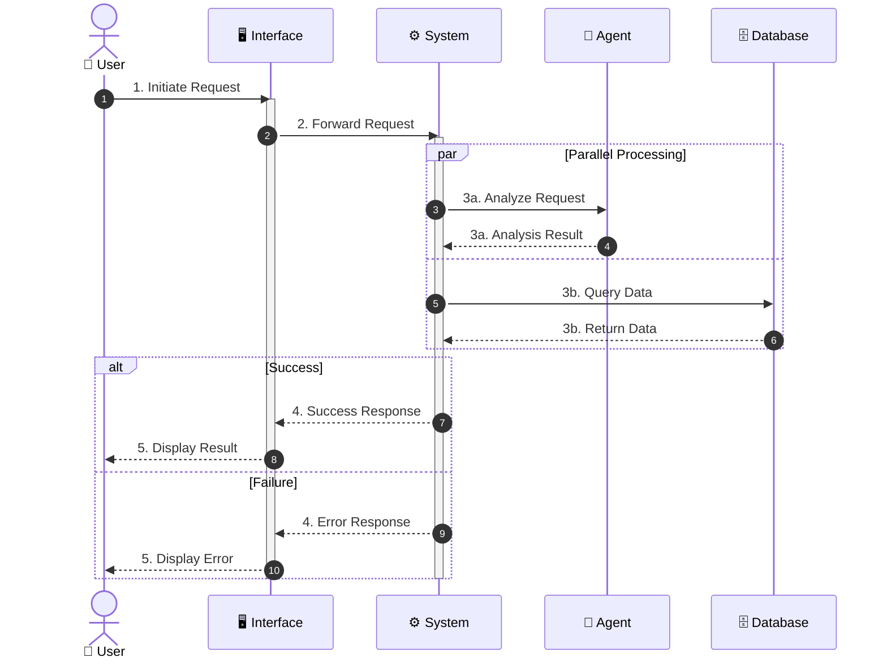
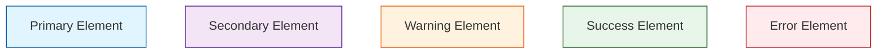

# Diagram and Documentation Standards

This document defines the mandatory standards for UML diagrams and documentation format in requirements analysis.

---

## Expression Priority (FUNDAMENTAL RULE)

**ALWAYS follow this priority when expressing requirements:**

```
1st Priority: Diagram (Visual representation)
    └── 2nd Priority: UML Diagram (Standard notation)
        └── 3rd Priority: Mermaid Syntax (Generation method)
```

### Priority Matrix

| Expression Method | Priority | Usage |
|-------------------|----------|-------|
| **UML Diagram (Mermaid)** | 🥇 Highest | Default choice - ALWAYS use first |
| **Other Diagrams (Mermaid)** | 🥈 Second | When UML type not applicable |
| **Table + Diagram** | 🥉 Third | Supplementary details only |
| **Text/Table only** | ❌ Avoid | Only when diagram is impossible |

### UML Diagram Selection Guide

| Requirement Type | UML Diagram | Mermaid Type |
|------------------|-------------|--------------|
| System interactions | Use Case Diagram | `graph TB` with actors |
| **Process flow** | **Activity Diagram** | **`stateDiagram-v2`** |
| Time-based interactions | Sequence Diagram | `sequenceDiagram` |
| Object relationships | Class Diagram | `classDiagram` |
| State transitions | State Diagram | `stateDiagram-v2` |
| Component structure | Component Diagram | `graph TB` with subgraphs |

### Non-UML Diagram Guide

| Visualization Type | Purpose | Mermaid Type |
|--------------------|---------|--------------|
| User Story Map | Release planning matrix | `graph TB` with subgraphs |
| Dependency Graph | Requirement relationships | `graph LR/TD` |
| Traceability | Mapping connections | `graph LR` |
| Mind Map | Brainstorming | `mindmap` |
| Timeline | Milestones | `timeline` |

> **IMPORTANT**: For **user activity flows** and **business processes**, ALWAYS use `stateDiagram-v2` (UML Activity Diagram), NOT `graph` (flowchart).

---

## 1. UML Use Case Diagram Standards

### MANDATORY Rules

- **Actors**: Must use stick figure icon (not rectangles)
- **Use Cases**: Must use ellipse shape
- **System Boundary**: Must use dashed rectangle
- **Relationships**: Must use correct stereotypes
  - `<<include>>`: Mandatory dependency (always executed)
  - `<<extend>>`: Optional extension (conditionally executed)
  - `<<generalize>>`: Inheritance relationship

### ❌ PROHIBITED

- Using simple flowcharts to represent use case diagrams
- Omitting system boundary
- Using incorrect relationship markers

### Mermaid Syntax for Use Case Diagram



---

## 2. Business Process Standards (Activity Diagram)

### MANDATORY Rules

- **Core user activity flows MUST use UML Activity Diagram**
- **Tables alone are NOT sufficient** - must have accompanying diagram
- **Parallel processing MUST be explicitly marked** using fork/join or `par` syntax
- **Decision points MUST use diamond shape**
- **Start/End MUST use standard notation** (filled circle / bull's eye)

### Activity Diagram Syntax



### Alternative: Flowchart with Swim Lanes



---

## 3. Use Case Main Flow Standards (Sequence Diagram)

### MANDATORY Rules

- **Use Case main flows MUST use Sequence Diagram**
- **Actor-System tables alone are NOT sufficient**
- **All key participants MUST be included**: User, UI, System, Agent, Database, External Services
- **Parallel execution MUST use `par` syntax**
- **Alternative flows use `alt` syntax**
- **Optional flows use `opt` syntax**

### ❌ PROHIBITED

Simple table format like:

| Step | Actor | System |
|------|-------|--------|
| 1 | Action | |
| 2 | | Response |

### ✅ REQUIRED



### Sequence Diagram Syntax Reference

| Syntax | Purpose | Example |
|--------|---------|---------|
| `par ... and ... end` | Parallel execution | Concurrent operations |
| `alt ... else ... end` | Alternative flows | Success/failure paths |
| `opt ... end` | Optional flow | Conditional execution |
| `loop ... end` | Repeated execution | Iteration |
| `break ... end` | Exit flow | Exception handling |
| `activate/deactivate` | Lifeline activation | Active processing |

---

## 4. Document Format Standards

### MANDATORY Rules

#### Text Formatting
- **Each analysis item MUST be on a separate line**
- **Key terms MUST be bold**
- **Consistent indentation** throughout document
- **Clear visual hierarchy** with proper heading levels

#### Example - CORRECT Format

```markdown
## Analysis Summary

**User Roles**:
- Operations personnel
- DevOps engineers
- Development engineers

**Core Activities**:
- Resource topology management
- Agent configuration
- Monitoring and inspection
- Problem diagnosis
- Fault handling

**Key Findings**:
- **Finding 1**: Description of first finding
- **Finding 2**: Description of second finding
```

#### Example - INCORRECT Format

```markdown
## Analysis Summary
User Roles: Operations personnel, DevOps engineers, Development engineers
Core Activities: Resource topology management, Agent configuration, Monitoring...
```

---

## 5. Diagram Quality Standards

### MANDATORY Rules

1. **All UML diagrams MUST follow standard syntax**
2. **Use Mermaid syntax for all diagrams**
3. **Apply appropriate styling and color coding**:
   - Primary elements: `fill:#e1f5fe` (light blue)
   - Secondary elements: `fill:#f3e5f5` (light purple)
   - Warning/attention: `fill:#fff3e0` (light orange)
   - Success/completion: `fill:#e8f5e9` (light green)
   - Error/critical: `fill:#ffebee` (light red)

4. **Complex processes MUST be decomposed** into multiple diagrams
5. **Each diagram MUST have a clear title**

### Style Template



---

## 6. Diagram Decomposition Guidelines

### When to Decompose

| Condition | Action |
|-----------|--------|
| More than 10 nodes | Split into sub-diagrams |
| Multiple swimlanes (>3) | Create separate diagrams per domain |
| Complex parallel flows | Separate detailed sequence diagram |
| Multiple abstraction levels | Use overview + detail diagrams |

### Decomposition Pattern

```
Overview Diagram (High-level)
    │
    ├── Detail Diagram 1 (Subprocess A)
    ├── Detail Diagram 2 (Subprocess B)
    └── Detail Diagram 3 (Subprocess C)
```

---

## Quick Reference Card

| Element | Standard | Mermaid Syntax |
|---------|----------|----------------|
| Actor | Stick figure | `[/"👤 Name"\]` |
| Use Case | Ellipse | `((Use Case))` |
| Activity | Rectangle | `[Activity]` |
| Decision | Diamond | `{Decision}` or `<<choice>>` |
| Parallel | Fork/Join | `par ... and ... end` |
| System Boundary | Dashed box | `subgraph` |
| Include | Dashed arrow with label | `-->|<<include>>|` |
| Extend | Dashed arrow with label | `-.->|<<extend>>|` |
