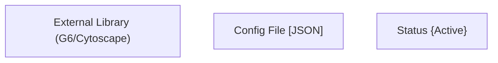
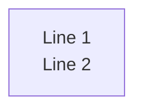
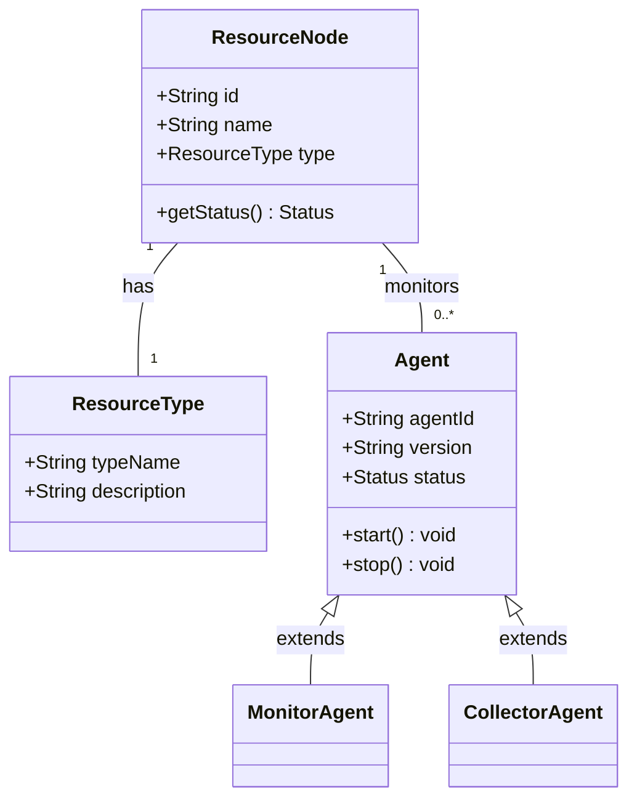
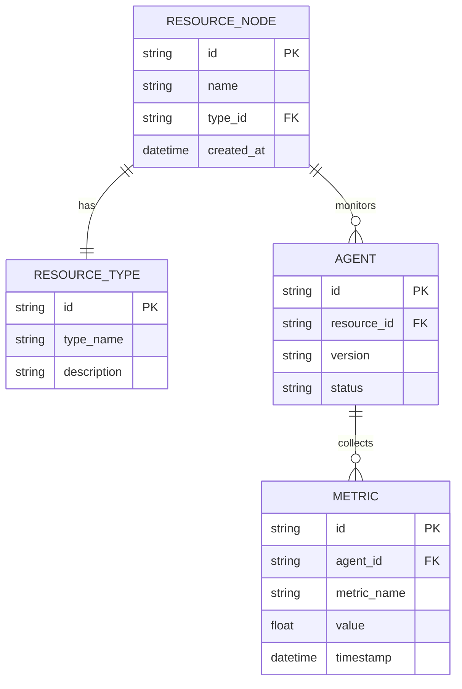

# Diagram and Documentation Standards

This document defines the mandatory standards for UML diagrams and documentation format in requirements analysis.

---

## Expression Priority (FUNDAMENTAL RULE)

**ALWAYS follow this priority when expressing requirements:**

```
1st Priority: Diagram (Visual representation)
    └── 2nd Priority: UML Diagram (Standard notation)
        └── 3rd Priority: Mermaid Syntax (Generation method)
```

### Priority Matrix

| Expression Method | Priority | Usage |
|-------------------|----------|-------|
| **UML Diagram (Mermaid)** | 🥇 Highest | Default choice - ALWAYS use first |
| **Other Diagrams (Mermaid)** | 🥈 Second | When UML type not applicable |
| **Table + Diagram** | 🥉 Third | Supplementary details only |
| **Text/Table only** | ❌ Avoid | Only when diagram is impossible |

### UML Diagram Selection Guide

| Requirement Type | UML Diagram | Mermaid Type |
|------------------|-------------|--------------|
| System interactions | Use Case Diagram | `graph TB` with actors |
| **Process flow** | **Activity Diagram** | **`stateDiagram-v2`** |
| Time-based interactions | Sequence Diagram | `sequenceDiagram` |
| **Domain model** | **Class Diagram** | **`classDiagram`** |
| **Data model** | **ER Diagram** | **`erDiagram`** |
| State transitions | State Diagram | `stateDiagram-v2` |
| Component structure | Component Diagram | `graph TB` with subgraphs |

> ⚠️ **Class Diagram vs ER Diagram**: Do NOT mix their syntax! See sections 4 and 5 for correct usage.

### Non-UML Diagram Guide

| Visualization Type | Purpose | Mermaid Type |
|--------------------|---------|--------------|
| User Story Map | Release planning matrix | `graph TB` with subgraphs |
| Dependency Graph | Requirement relationships | `graph LR/TD` |
| Traceability | Mapping connections | `graph LR` |
| Mind Map | Brainstorming | `mindmap` |
| Timeline | Milestones | `timeline` |

> **IMPORTANT**: For **user activity flows** and **business processes**, ALWAYS use `stateDiagram-v2` (UML Activity Diagram), NOT `graph` (flowchart).

---

## ⛔ Mermaid Syntax Constraints (MANDATORY)

**CRITICAL**: Mermaid has strict syntax rules. Violating these will cause parse errors.

### Special Characters in Node Text

| Character | Problem | Solution |
|-----------|---------|----------|
| `()` | Parsed as node shape | Use quotes: `["text (note)"]` |
| `[]` | Parsed as node shape | Use quotes: `["text [note]"]` |
| `{}` | Parsed as node shape | Use quotes: `["text {note}"]` |
| `<>` | Parsed as HTML/link | Use quotes or escape: `["text <note>"]` |
| `/` | May cause issues | Use quotes: `["A/B"]` |

### Node Definition Rules

**DO**:


**DO NOT**:
```
graph TD
    A[External Library (G6/Cytoscape)]   ❌ Parse error
    B[Config File [JSON]]                 ❌ Parse error
    C[Status {Active}]                    ❌ Parse error
```

### Text with Line Breaks

**DO**:


**DO NOT**:
```
graph TD
    A[Line 1<br/>(Note)]   ❌ Parentheses cause parse error
```

### Verification Checklist

Before generating ANY Mermaid diagram, verify:
- [ ] All node text with special characters `()[]{}/<>` wrapped in quotes `""`
- [ ] No unescaped parentheses in node labels
- [ ] No unescaped brackets in node labels
- [ ] Line breaks `<br/>` only used inside quoted strings

---

## 1. UML Use Case Diagram Standards

### MANDATORY Rules

- **Actors**: Must use stick figure icon (not rectangles)
- **Use Cases**: Must use ellipse shape
- **System Boundary**: Must use dashed rectangle
- **Relationships**: Must use correct stereotypes
  - `<<include>>`: Mandatory dependency (always executed)
  - `<<extend>>`: Optional extension (conditionally executed)
  - `<<generalize>>`: Inheritance relationship

### ❌ PROHIBITED

- Using simple flowcharts to represent use case diagrams
- Omitting system boundary
- Using incorrect relationship markers

### Mermaid Syntax for Use Case Diagram

```mermaid
graph TB
    subgraph System["System Boundary"]
        direction TB
        UC1((Use Case 1))
        UC2((Use Case 2))
        UC3((Use Case 3))

        UC1 -->|<<include>>| UC2
        UC1 -.->|<<extend>>| UC3
    end

    Actor1[/"👤 Actor 1"\]
    Actor2[/"👤 Actor 2"\]

    Actor1 --> UC1
    Actor2 --> UC2

    style UC1 fill:#e1f5fe
    style UC2 fill:#e1f5fe
    style UC3 fill:#fff3e0
```



---

## 2. Business Process Standards (Activity Diagram)

### MANDATORY Rules

- **Core user activity flows MUST use UML Activity Diagram**
- **Tables alone are NOT sufficient** - must have accompanying diagram
- **Parallel processing MUST be explicitly marked** using fork/join or `par` syntax
- **Decision points MUST use diamond shape**
- **Start/End MUST use standard notation** (filled circle / bull's eye)

### Activity Diagram Syntax


### Alternative: Flowchart with Swim Lanes

```mermaid
flowchart TB
    subgraph User["👤 User"]
        A1[Start Request]
        A4[Receive Result]
    end

    subgraph System["System"]
        A2[Process Request]
        A3[Generate Response]
    end

    A1 --> A2
    A2 --> A3
    A3 --> A4
```



---

## 3. Use Case Main Flow Standards (Sequence Diagram)

### MANDATORY Rules

- **Use Case main flows MUST use Sequence Diagram**
- **Actor-System tables alone are NOT sufficient**
- **All key participants MUST be included**: User, UI, System, Agent, Database, External Services
- **Parallel execution MUST use `par` syntax**
- **Alternative flows use `alt` syntax**
- **Optional flows use `opt` syntax**

### ❌ PROHIBITED

Simple table format like:

| Step | Actor | System |
|------|-------|--------|
| 1 | Action | |
| 2 | | Response |

### ✅ REQUIRED

```mermaid
sequenceDiagram
    autonumber

    actor User as 👤 User
    participant UI as 🖥️ Interface
    participant System as ⚙️ System
    participant Agent as 🤖 Agent
    participant DB as 🗄️ Database

    User->>UI: 1. Initiate Request
    activate UI
    UI->>System: 2. Forward Request
    activate System

    par Parallel Processing
        System->>Agent: 3a. Analyze Request
        Agent-->>System: 3a. Analysis Result
    and
        System->>DB: 3b. Query Data
        DB-->>System: 3b. Return Data
    end

    alt Success
        System-->>UI: 4. Success Response
        UI-->>User: 5. Display Result
    else Failure
        System-->>UI: 4. Error Response
        UI-->>User: 5. Display Error
    end

    deactivate System
    deactivate UI
```



### Sequence Diagram Syntax Reference

| Syntax | Purpose | Example |
|--------|---------|---------|
| `par ... and ... end` | Parallel execution | Concurrent operations |
| `alt ... else ... end` | Alternative flows | Success/failure paths |
| `opt ... end` | Optional flow | Conditional execution |
| `loop ... end` | Repeated execution | Iteration |
| `break ... end` | Exit flow | Exception handling |
| `activate/deactivate` | Lifeline activation | Active processing |

---

## 4. Class Diagram Standards (Domain Model)

### When to Use

- **Domain modeling**: Core business entities and relationships
- **Data structure design**: Object attributes and methods
- **Inheritance hierarchies**: Class specialization

### MANDATORY Rules

- Use `classDiagram` syntax for object relationships
- Define attributes with visibility (`+` public, `-` private, `#` protected)
- Use correct relationship notation

### Class Diagram Syntax



### Relationship Syntax Reference

| Relationship | Syntax | Description |
|--------------|--------|-------------|
| Association | `A -- B` | Basic relationship |
| Association (labeled) | `A "1" -- "0..*" B : has` | With cardinality and label |
| Inheritance | `Parent <\|-- Child` | Generalization |
| Composition | `A *-- B` | Strong ownership (lifecycle bound) |
| Aggregation | `A o-- B` | Weak ownership (independent lifecycle) |
| Dependency | `A ..> B` | Uses relationship |
| Realization | `A ..\|> B` | Interface implementation |

### ⚠️ COMMON MISTAKE

```
❌ WRONG (ER Diagram syntax in Class Diagram):
classDiagram
    ResourceNode ||--|| ResourceType

✅ CORRECT (Class Diagram syntax):
classDiagram
    ResourceNode "1" -- "1" ResourceType : has
```

---

## 5. ER Diagram Standards (Data Model)

### When to Use

- **Database design**: Entity relationships for persistence
- **Data modeling**: Tables and foreign key relationships
- **System integration**: Data exchange structures

### MANDATORY Rules

- Use `erDiagram` syntax for entity relationships
- Define attributes with data types
- Use correct cardinality notation

### ER Diagram Syntax



### Cardinality Notation

| Syntax | Meaning |
|--------|---------|
| `\|\|--\|\|` | One to One |
| `\|\|--o{` | One to Many |
| `o{--o{` | Many to Many |
| `\|\|--o\|` | One to Zero or One |
| `}o--o{` | Zero or Many to Zero or Many |

### Comparison: Class Diagram vs ER Diagram

| Aspect | Class Diagram (`classDiagram`) | ER Diagram (`erDiagram`) |
|--------|-------------------------------|--------------------------|
| **Purpose** | Domain/Object modeling | Database/Data modeling |
| **Relationship** | `"1" -- "0..*"` | `\|\|--o{` |
| **Inheritance** | `<\|--` (supported) | Not supported |
| **Methods** | Supported | Not supported |
| **Primary Key** | Not explicit | `PK` notation |
| **Foreign Key** | Not explicit | `FK` notation |

### ⚠️ DO NOT MIX SYNTAX

```
❌ WRONG (mixing syntax):
classDiagram
    A ||--o{ B

❌ WRONG (mixing syntax):
erDiagram
    A <|-- B

✅ CORRECT:
Use classDiagram for OOP relationships
Use erDiagram for database relationships
```

---

## 6. Document Format Standards

### MANDATORY Rules

#### Text Formatting
- **Each analysis item MUST be on a separate line**
- **Key terms MUST be bold**
- **Consistent indentation** throughout document
- **Clear visual hierarchy** with proper heading levels

#### Example - CORRECT Format

```markdown
## Analysis Summary

**User Roles**:
- Operations personnel
- DevOps engineers
- Development engineers

**Core Activities**:
- Resource topology management
- Agent configuration
- Monitoring and inspection
- Problem diagnosis
- Fault handling

**Key Findings**:
- **Finding 1**: Description of first finding
- **Finding 2**: Description of second finding
```

#### Example - INCORRECT Format

```markdown
## Analysis Summary
User Roles: Operations personnel, DevOps engineers, Development engineers
Core Activities: Resource topology management, Agent configuration, Monitoring...
```

---

## 7. Diagram Quality Standards

### MANDATORY Rules

1. **All UML diagrams MUST follow standard syntax**
2. **Use Mermaid syntax for all diagrams**
3. **Apply appropriate styling and color coding**:
   - Primary elements: `fill:#e1f5fe` (light blue)
   - Secondary elements: `fill:#f3e5f5` (light purple)
   - Warning/attention: `fill:#fff3e0` (light orange)
   - Success/completion: `fill:#e8f5e9` (light green)
   - Error/critical: `fill:#ffebee` (light red)

4. **Complex processes MUST be decomposed** into multiple diagrams
5. **Each diagram MUST have a clear title**

### Style Template


---

## 8. Diagram Decomposition Guidelines

### When to Decompose

| Condition | Action |
|-----------|--------|
| More than 10 nodes | Split into sub-diagrams |
| Multiple swimlanes (>3) | Create separate diagrams per domain |
| Complex parallel flows | Separate detailed sequence diagram |
| Multiple abstraction levels | Use overview + detail diagrams |

### Decomposition Pattern

```
Overview Diagram (High-level)
    │
    ├── Detail Diagram 1 (Subprocess A)
    ├── Detail Diagram 2 (Subprocess B)
    └── Detail Diagram 3 (Subprocess C)
```

---

## Quick Reference Card

| Element | Standard | Mermaid Syntax |
|---------|----------|----------------|
| Actor | Stick figure | `[/"👤 Name"\]` |
| Use Case | Ellipse | `((Use Case))` |
| Activity | Rectangle | `[Activity]` |
| Decision | Diamond | `{Decision}` or `<<choice>>` |
| Parallel | Fork/Join | `par ... and ... end` |
| System Boundary | Dashed box | `subgraph` |
| Include | Dashed arrow with label | `-->|<<include>>|` |
| Extend | Dashed arrow with label | `-.->|<<extend>>|` |
