# Phase 3: Requirements Analysis

**Phase Objective**: Deep analysis of dependencies, feasibility, and implementation approaches.
**Time Allocation**: 20% of total effort
**Your Role**: Professional Requirements Analyst

---

## Quick Reference

| Method | Focus | Output | When to Use |
|--------|-------|--------|-------------|
| User Story Mapping | User activities and priorities | Story map with MVP | All projects |
| Use Case Analysis | Actor-system interactions | Use case documents | Complex interactions |
| Success Criteria | Measurable outcomes | SMART criteria list | All requirements |
| Event Storming | Domain events and commands | Domain model | Complex business logic |
| Dependency Analysis | Requirement relationships | Dependency graph | Multi-requirement projects |

---

## Output

**File**: `.kiro/specs/[feature-name]/03-analysis.md`
**Template**: See `template-analysis.md`

---

## MANDATORY: Diagram and Documentation Standards

**CRITICAL**: You MUST load and follow `helper-diagram-standards.md` BEFORE creating any diagrams or documentation. This is NON-NEGOTIABLE.

### Expression Priority (MUST FOLLOW)

```
1st Priority: Diagram (Visual representation)
    └── 2nd Priority: UML Diagram (Standard notation)
        └── 3rd Priority: Mermaid Syntax (Generation method)
```

**Rule**: ALWAYS prefer diagrams over text/tables. When using diagrams, ALWAYS prefer UML. When generating UML, ALWAYS use Mermaid syntax.

| Expression Method | Priority | When to Use |
|-------------------|----------|-------------|
| **UML Diagram (Mermaid)** | 🥇 Highest | Default choice for all requirements |
| **Other Diagrams (Mermaid)** | 🥈 Second | When UML is not applicable |
| **Table + Diagram** | 🥉 Third | Supplementary details only |
| **Text/Table only** | ❌ Avoid | Only when diagram is impossible |

### Key Rules Summary

1. **UML Use Case Diagram**:
   - Actors: stick figure icon
   - Use Cases: ellipse shape
   - System Boundary: dashed rectangle
   - Relationships: `<<include>>` and `<<extend>>` stereotypes
   - ❌ PROHIBITED: Simple flowcharts instead of UML

2. **Business Process (Activity Diagram)**:
   - Core user flows MUST use UML Activity Diagram
   - Tables alone are NOT sufficient
   - Parallel processing MUST use fork/join or `par` syntax

3. **Use Case Main Flow (Sequence Diagram)**:
   - Main flows MUST use Sequence Diagram
   - Include all participants: User, UI, System, Agent, Database
   - Parallel execution MUST use `par` syntax
   - ✅ ALWAYS accompany tables with Sequence Diagrams (tables alone are insufficient)

4. **Document Format**:
   - Each analysis item on separate line
   - Key terms in **bold**
   - Consistent indentation
   - Clear visual hierarchy

5. **Diagram Quality**:
   - Use Mermaid syntax for all diagrams
   - Apply color coding for element types
   - Complex processes MUST be decomposed

---

## Pre-Check (GATE CHECK)

**MUST pass this check before starting**:

- [ ] **Phase 2 completed?** Verify `02-sort.md` exists with value sorting matrix
- [ ] **Inputs available?** Confirm prioritization (MoSCoW/RICE) is complete
- [ ] **Unclear items identified?** List requirements flagged for clarification
- [ ] **Helper file loaded?** Load `helper-diagram-standards.md` for diagram rules

**If ANY check fails**: STOP. NEVER proceed. Return to Phase 2 or load required files.

---

## Your Tasks (NON-NEGOTIABLE)

1. **User Story Mapping**: Create complete user story maps
2. **Use Case Analysis**: Draw main use case diagrams and write use case documents
3. **Success Criteria Definition**: Define measurable success criteria for each requirement
4. **Dependency Analysis**: Map requirement dependencies and identify conflicts
5. **Feasibility Assessment**: Evaluate technical feasibility and risks

## Professional Qualities You MUST Demonstrate

- ✅ Use professional methods (user story mapping, use case analysis, event storming)
- ✅ Deep analysis (requirement dependencies, technical feasibility)
- ✅ Domain modeling (identify bounded contexts, aggregates)
- ✅ Visual output (story maps, use case diagrams, domain models)

## What You MUST NEVER Do

- ❌ NEVER be superficial - deep analysis is mandatory
- ❌ NEVER ignore requirement dependencies - document all relationships
- ❌ NEVER skip technical feasibility assessment - it is required
- ❌ NEVER force-fit DDD just to use it (DDD suits complex business; simple projects can use simplified models)

---

## Method 1: User Story Mapping

**OUTPUT TEMPLATE**: Use `template-analysis.md` for output format.

### Core User Activity Flow (UML Activity Diagram)

**MUST use `stateDiagram-v2` for user activity flows:**

```mermaid
stateDiagram-v2
    [*] --> Browse: Start

    Browse --> Select
    Select --> Decision1

    state Decision1 <<choice>>
    Decision1 --> Purchase: [Add to Cart]
    Decision1 --> Browse: [Continue Shopping]

    Purchase --> Payment
    Payment --> Decision2

    state Decision2 <<choice>>
    Decision2 --> Receive: [Success]
    Decision2 --> Purchase: [Retry]

    Receive --> Support
    Support --> [*]: End

    Browse: 浏览商品 (Browse)
    Select: 选择商品 (Select)
    Purchase: 下单购买 (Purchase)
    Payment: 支付处理 (Payment)
    Receive: 收货确认 (Receive)
    Support: 售后支持 (Support)
```



**Activity Diagram Elements:**
| Element | UML Standard | Mermaid Syntax |
|---------|--------------|----------------|
| Start Node | Filled circle | `[*] -->` |
| End Node | Bull's eye | `--> [*]` |
| Activity | Rounded rectangle | `StateName: Label` |
| Decision | Diamond | `state Name <<choice>>` |
| Transition | Arrow with guard | `--> Target: [condition]` |
| Fork/Join | Thick bar | `state Name { ... }` |

### User Story Format

```
As a [role],
I want [feature/capability],
So that [business value/benefit].
```

### INVEST Criteria

Each user story MUST be:
- **I**ndependent: Can be developed separately
- **N**egotiable: Details can be discussed
- **V**aluable: Delivers value to user/business
- **E**stimable: Can be sized/estimated
- **S**mall: Fits within a sprint
- **T**estable: Has clear acceptance criteria

### User Story Map Visualization

> **Note**: Story Map is an Agile visualization technique (not UML). Use `graph TB` with subgraphs for matrix layout.

```mermaid
graph TB
    subgraph Activities["USER ACTIVITY FLOW →"]
        direction LR
        A1["📦 Activity 1<br/>Browse"]
        A2["🔍 Activity 2<br/>Select"]
        A3["💳 Activity 3<br/>Purchase"]
        A4["📬 Activity 4<br/>Receive"]
        A5["🛠️ Activity 5<br/>Support"]
        A1 --> A2 --> A3 --> A4 --> A5
    end

    subgraph MVP["MVP Release"]
        direction LR
        S11[US-1.1] --> S21[US-2.1] --> S31[US-3.1] --> S41[US-4.1]
        S12[US-1.2] --> S22[US-2.2] --> S32[US-3.2]
    end

    subgraph V11["Version 1.1"]
        direction LR
        S13[US-1.3] --> S23[US-2.3] --> S33[US-3.3] --> S42[US-4.2] --> S51[US-5.1]
    end

    subgraph V20["Version 2.0"]
        direction LR
        S14[US-1.4] --> S24[US-2.4] --> S35[US-3.5] --> S43[US-4.3] --> S52[US-5.2]
    end

    A1 -.-> S11
    A1 -.-> S13
    A1 -.-> S14

    style A1 fill:#e1f5fe,stroke:#01579b
    style A2 fill:#e1f5fe,stroke:#01579b
    style A3 fill:#e1f5fe,stroke:#01579b
    style A4 fill:#e1f5fe,stroke:#01579b
    style A5 fill:#e1f5fe,stroke:#01579b
```



**Story Map Structure:**
| Row | Description | Priority |
|-----|-------------|----------|
| **Activities** | User journey steps (left to right) | - |
| **MVP** | Minimum stories to launch | P0 |
| **V1.1** | First enhancement release | P1 |
| **V2.0** | Future features | P2 |

### Story Map Documentation

```markdown
## User Story Map: [Feature/Epic Name]

### User Activities (Left to Right = User Flow)
1. **[Activity 1]**: [Description of what user is trying to do]
2. **[Activity 2]**: [Description]
3. **[Activity 3]**: [Description]

### MVP Stories (Minimum to launch)
| Activity | Story ID | Story | Priority |
|----------|----------|-------|----------|
| Activity 1 | US-001 | As a [role], I want... | P0 |
| Activity 2 | US-002 | As a [role], I want... | P0 |

### V1.1 Stories (First enhancement)
| Activity | Story ID | Story | Priority |
|----------|----------|-------|----------|
| Activity 1 | US-003 | As a [role], I want... | P1 |

### V2.0 Stories (Future)
| Activity | Story ID | Story | Priority |
|----------|----------|-------|----------|
| Activity 1 | US-004 | As a [role], I want... | P2 |
```

---

## Method 2: Use Case Analysis

### Use Case Diagram Elements

```mermaid
graph TB
    subgraph System["System Boundary"]
        direction TB
        UCA((Use Case A))
        UCB((Use Case B))
        UCC((Use Case C))
        UCD((Use Case D))

        UCA -->|<<include>>| UCC
        UCA --> UCB
        UCB -.->|<<extend>>| UCD
    end

    Actor1[/"👤 Actor 1"\]
    Actor2[/"👤 Actor 2"\]

    Actor1 --> UCA
    Actor2 --> UCB

    style UCA fill:#e1f5fe,stroke:#01579b
    style UCB fill:#e1f5fe,stroke:#01579b
    style UCC fill:#e1f5fe,stroke:#01579b
    style UCD fill:#fff3e0,stroke:#e65100
```



**Diagram Elements:**
| Element | Mermaid Syntax | Description |
|---------|----------------|-------------|
| Actor | `[/"👤 Name"\]` | Stick figure representation |
| Use Case | `((Name))` | Ellipse shape |
| System Boundary | `subgraph` | Dashed rectangle container |
| Include | `-->\|<<include>>\|` | Mandatory dependency |
| Extend | `-.->\|<<extend>>\|` | Optional extension |

### Use Case Document Template

```markdown
## Use Case: [UC-XXX] [Use Case Name]

### Basic Information
| Field | Value |
|-------|-------|
| **Use Case ID** | UC-XXX |
| **Name** | [Descriptive name] |
| **Primary Actor** | [Who initiates] |
| **Secondary Actors** | [Other participants] |
| **Level** | User Goal / Subfunction |
| **Priority** | P0 / P1 / P2 |

### Description
[Brief description of what this use case accomplishes]

### Preconditions
1. [Condition that must be true before starting]
2. [Another precondition]

### Postconditions (Success)
1. [State after successful completion]
2. [Another post-condition]

### Main Flow (Happy Path)
| Step | Actor | System |
|------|-------|--------|
| 1 | [Actor action] | |
| 2 | | [System response] |
| 3 | [Actor action] | |
| 4 | | [System response] |

### Alternative Flows
**A1: [Alternative scenario name]**
- Branches from step: [X]
- Condition: [When this alternative applies]
- Steps:
  1. [Alternative step]
  2. [Alternative step]
- Rejoins at step: [Y] or ends

### Exception Flows
**E1: [Error scenario name]**
- Trigger: [What causes this exception]
- Steps:
  1. System displays error message: "[Exact message]"
  2. [Recovery action]
- End state: [How it ends]

### Business Rules
| Rule ID | Rule Description |
|---------|------------------|
| BR-001 | [Rule that applies to this use case] |
| BR-002 | [Another rule] |

### Non-Functional Requirements
- **Performance**: [Specific metrics]
- **Security**: [Security requirements]
```

---

## Method 3: Success Criteria Definition

### Purpose

Success Criteria define **measurable outcomes** that determine whether a requirement has been successfully implemented. They bridge the gap between user stories and acceptance tests.

### SMART Criteria

Each success criterion MUST be **SMART**:

| Attribute | Description | Example |
|-----------|-------------|---------|
| **S**pecific | Clear and unambiguous | "Page loads in under 2 seconds" not "Page loads fast" |
| **M**easurable | Quantifiable metric | "95% of users complete checkout" |
| **A**chievable | Realistic given constraints | Consider technical limitations |
| **R**elevant | Aligned with business goals | Ties to user value |
| **T**ime-bound | Has defined timeframe | "Within first 30 days of launch" |

### Success Criteria Categories

| Category | Focus | Example Metrics |
|----------|-------|-----------------|
| **Functional** | Feature behavior | Task completion rate, error rate |
| **Performance** | Speed and efficiency | Response time, throughput |
| **Usability** | User experience | Task success rate, time-on-task |
| **Business** | Business outcomes | Conversion rate, revenue impact |
| **Quality** | System quality | Defect density, uptime |

### Success Criteria Template

```markdown
## Success Criteria: [Requirement/Feature ID]

### SC-001: [Criterion Name]

| Field | Value |
|-------|-------|
| **Requirement** | REQ-XXX / US-XXX |
| **Category** | Functional / Performance / Usability / Business / Quality |
| **Metric** | [What to measure] |
| **Target** | [Quantified goal] |
| **Baseline** | [Current state, if applicable] |
| **Measurement Method** | [How to measure] |
| **Verification Point** | [When to verify] |

**Definition of Success**:
> [Clear statement of what success looks like]

**Definition of Failure**:
> [Clear statement of what constitutes failure]
```

### Success Criteria Traceability


### Example Success Criteria

| SC ID | Requirement | Category | Metric | Target |
|-------|-------------|----------|--------|--------|
| SC-001 | US-001 Login | Functional | Login success rate | ≥ 99.5% |
| SC-002 | US-001 Login | Performance | Login response time | < 1 second |
| SC-003 | US-001 Login | Security | Failed login lockout | After 5 attempts |
| SC-004 | US-002 Search | Usability | Search result relevance | ≥ 90% accuracy |
| SC-005 | REQ-010 | Business | User retention | ≥ 80% after 30 days |

---

## Method 4: Event Storming (for Complex Systems)

### Event Storming Elements

| Element | Color | Description | Example |
|---------|-------|-------------|---------|
| **Domain Event** | Orange | Something that happened | "Order Placed" |
| **Command** | Blue | Action that triggers event | "Place Order" |
| **Aggregate** | Yellow | Entity that receives command | "Order" |
| **Policy** | Purple | Reaction rule | "When order placed, notify warehouse" |
| **Read Model** | Green | Data needed for decision | "Available inventory" |
| **External System** | Pink | Third-party integration | "Payment Gateway" |
| **User/Actor** | Small yellow | Who triggers command | "Customer" |
| **Hot Spot** | Red | Unresolved question | "How to handle split shipment?" |

### Event Storming Output

```markdown
## Event Storming Results: [Domain Name]

### Timeline (Left to Right)
```
[User] → [Command] → [Aggregate] → [Domain Event] → [Policy] → [Next Command]
```

### Domain Events Identified
| Event | Aggregate | Triggered By | Triggers |
|-------|-----------|--------------|----------|
| Order Created | Order | Place Order command | Inventory Reserved |
| Payment Received | Payment | Process Payment command | Order Confirmed |
| Order Shipped | Order | Ship Order command | Customer Notified |

### Commands Identified
| Command | Actor | Aggregate | Preconditions |
|---------|-------|-----------|---------------|
| Place Order | Customer | Order | Cart not empty |
| Process Payment | System | Payment | Order created |
| Ship Order | Warehouse Staff | Order | Payment received |

### Aggregates Identified
| Aggregate | Responsibilities | Key Attributes |
|-----------|------------------|----------------|
| Order | Manage order lifecycle | items, status, total |
| Payment | Handle payment processing | amount, status, method |
| Inventory | Track stock levels | quantity, reserved |

### Hot Spots (Unresolved Questions)
1. 🔴 [Question 1 - needs clarification]
2. 🔴 [Question 2 - needs decision]
```

---

## Method 5: Dependency Analysis

### Dependency Types

| Type | Description | Example | Risk Level |
|------|-------------|---------|------------|
| **Mandatory** | Must complete A before B | Login before checkout | High |
| **Optional** | A enhances B | Search filters enhance search | Low |
| **Conflicting** | A and B cannot coexist | Two auth methods | Critical |
| **External** | Depends on outside system | Payment gateway | High |

### Dependency Matrix

```markdown
## Requirements Dependency Matrix

| Req ID | Depends On | Dependency Type | Impact if Delayed |
|--------|------------|-----------------|-------------------|
| REQ-005 | REQ-001, REQ-002 | Mandatory | Blocks entire feature |
| REQ-008 | REQ-005 | Mandatory | Blocks payment flow |
| REQ-010 | External API | External | Risk: API availability |
| REQ-012 | REQ-003 | Optional | Degraded experience |

### Dependency Graph


### Critical Path


**Critical Path**: REQ-001 → REQ-005 → REQ-008 → REQ-011 (blocks release)

### Risks Identified
| Risk | Requirements | Mitigation |
|------|--------------|------------|
| Circular dependency | [List] | [Solution] |
| External dependency | [List] | [Fallback plan] |
```

---

## Exit Criteria (NON-NEGOTIABLE)

| Criteria | Standard | Verification | Status |
|----------|----------|--------------|--------|
| **Diagram Standards** | All diagrams follow UML/Mermaid standards | Check against `helper-diagram-standards.md` | [ ] |
| **Expression Priority** | Diagrams used over tables/text | Verify no text-only requirements | [ ] |
| User Story Map | Core user journeys mapped | Verify activity flow | [ ] |
| Use Case Diagrams | Main use cases documented with Sequence Diagrams | Review interactions | [ ] |
| **Success Criteria** | SMART criteria defined for key requirements | Verify measurability | [ ] |
| Domain Model | Bounded contexts identified (if applicable) | Verify aggregates | [ ] |
| Dependency Graph | Dependencies mapped | Check for circular | [ ] |
| Feasibility Assessment | Technical risks evaluated | Risk assessment complete | [ ] |

---

## Next Step

After completing this phase, proceed to:

**Phase 4: Clarification**
- Systematic questioning to eliminate ambiguity
- Requirement refinement and validation
- Release planning
