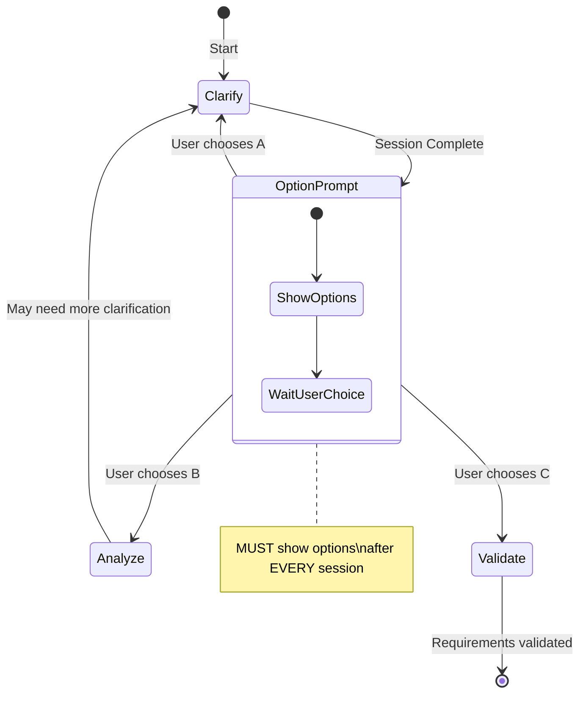

# Phase 4: Requirements Clarification

**Phase Objective**: Eliminate ambiguity through targeted questioning and document all clarification decisions.
**Time Allocation**: 15% of total effort
**Your Role**: Professional Requirements Analyst

---

## Quick Reference

| Aspect | Guideline |
|--------|-----------|
| Goal | Clarify ALL critical ambiguities (no fixed limit) |
| Question Format | Multiple-choice (2-4 options) or Short phrase |
| Delivery | ONE question at a time, wait for answer |
| Output Files | `clarification.md` (log) + update Phase 3 outputs |

### ⚠️ CRITICAL: Update Files After EACH Answer

**After user answers EACH question, you MUST IMMEDIATELY:**
1. Write Q&A to `clarification.md`
2. Check and update ALL affected Phase 3 outputs (see `POWER.md` → Output Structure)

**DO NOT** ask next question until all affected files are updated.

---

## Output

**File**: `.kiro/specs/[feature-name]/clarification.md`

> **Dependencies**: See `POWER.md` → File Dependencies for required template and helper files.

---

## Pre-Check (GATE CHECK)

**MUST pass this check before starting**:

- [ ] **Phase 3 completed?** Verify `requirements.md` exists with user stories and use cases
- [ ] **Ambiguities identified?** List requirements with `[NEEDS CLARIFICATION]` markers
- [ ] **Stakeholder available?** User can answer clarification questions

**If ANY check fails**: STOP. Return to Phase 3 or wait for stakeholder availability.

---

## Validation Failure Check (PRIORITY)

**CRITICAL**: Before starting clarification, check if `validation.md` exists. If it does, this is a **re-clarification** session triggered by validation failures.

### Step 1: Check for Validation File

Check if `validation.md` exists in the current spec folder.

### Step 2: If Validation File Exists

**You MUST:**

1. **Load and analyze** `validation.md`
2. **Extract failed dimensions** - Identify dimensions with score < 80% or status ❌/⚠️
3. **List specific issues** - Extract the "Negative Findings" from each failed dimension
4. **Prioritize clarification** - Focus questions on issues causing validation failures

### Step 3: Display Validation Failure Summary

```markdown
---
## Re-Clarification Session (Post-Validation)

I detected a previous validation report. Here are the **validation failures** that need clarification:

### Failed Dimensions Summary

| Dimension | Score | Status | Key Issues |
|-----------|-------|--------|------------|
| [Dimension] | [X]% | ❌/⚠️ | [Issue summary] |
| ... | ... | ... | ... |

### Priority Clarification Areas

Based on validation failures, I will focus clarification on:

1. **[Issue Category]**: [Specific issue from validation]
   - Related Requirements: [REQ-XXX, REQ-YYY]
   - Validation Finding: "[Quote from negative findings]"

2. **[Issue Category]**: [Specific issue from validation]
   - Related Requirements: [REQ-XXX]
   - Validation Finding: "[Quote from negative findings]"

---
Proceeding with targeted clarification questions...
```

### Validation-to-Clarification Mapping

| Failed Dimension | Clarification Focus |
|------------------|---------------------|
| **Authenticity** | Verify user needs, confirm stakeholder requirements |
| **Completeness** | Fill missing specifications, clarify unclear parts |
| **Consistency** | Resolve conflicts, align terminology |
| **Feasibility** | Clarify scope, discuss constraints with stakeholders |
| **Verifiability** | Define acceptance criteria, quantify requirements |

### Question Priority Order (Re-Clarification)

When re-clarifying after validation failure:

1. **First**: Questions directly addressing validation failures (highest priority)
2. **Second**: Questions about related requirements affected by failures
3. **Third**: New ambiguities discovered during validation
4. **Last**: Standard ambiguity taxonomy items

---

## Ambiguity Taxonomy (MUST SCAN)

Perform a structured ambiguity scan using this taxonomy:

### 1. Functional Scope & Behavior

| Check Point | Questions to Consider |
|-------------|----------------------|
| Core user goals | What defines success for the user? |
| Success criteria | How do we measure if the feature works? |
| Out-of-scope | What is explicitly NOT included? |
| User roles | Are all personas clearly differentiated? |

### 2. Domain & Data Model

| Check Point | Questions to Consider |
|-------------|----------------------|
| Entities & attributes | Are all data fields defined? |
| Identity & uniqueness | What makes each record unique? |
| Lifecycle/state | What states can entities transition through? |
| Data volume | What scale assumptions are we making? |

### 3. Interaction & UX Flow

| Check Point | Questions to Consider |
|-------------|----------------------|
| User journeys | Are critical paths fully documented? |
| Error states | What happens when things go wrong? |
| Empty states | What does the user see with no data? |
| Loading states | How is progress communicated? |

### 4. Non-Functional Quality Attributes

| Check Point | Questions to Consider |
|-------------|----------------------|
| Performance | Latency and throughput targets? |
| Scalability | Horizontal/vertical limits? |
| Reliability | Uptime and recovery requirements? |
| Security | Authentication and authorization rules? |
| Compliance | Regulatory constraints? |

### 5. Integration & External Dependencies

| Check Point | Questions to Consider |
|-------------|----------------------|
| External APIs | Which services? Failure modes? |
| Data formats | Import/export specifications? |
| Protocol versions | API versioning strategy? |

### 6. Edge Cases & Failure Handling

| Check Point | Questions to Consider |
|-------------|----------------------|
| Negative scenarios | What if user provides invalid input? |
| Rate limiting | How to handle abuse? |
| Concurrent edits | Conflict resolution strategy? |

### 7. Terminology & Consistency

| Check Point | Questions to Consider |
|-------------|----------------------|
| Glossary terms | Are key terms defined? |
| Synonyms | Are deprecated terms identified? |

---

## Execution Flow

### Step 1: Load and Analyze Specification

Read `requirements.md` and scan for ambiguities using the taxonomy above.

**Identify**:
- Vague terms: "user-friendly", "fast", "secure", "flexible"
- Missing details: "users can login" (which users? how?)
- Unclear scope: "manage products" (create/edit/delete/view?)
- Undefined conditions: "when needed", "if required"
- Placeholders: `[TBD]`, `[NEEDS CLARIFICATION]`

### Step 2: Generate Prioritized Questions

Create a prioritized queue of clarification questions:

**Question Constraints**:
- **Answerable**: Multiple-choice (2-4 options) OR Short phrase (<=5 words)
- **Impactful**: Must materially impact architecture, data model, UX, or compliance
- **Balanced**: Cover different categories from the taxonomy
- **Non-trivial**: Exclude already-answered or obvious questions

**Priority Order**:
1. Functional scope ambiguities (blocking)
2. Data model ambiguities (architectural impact)
3. Non-functional requirements (quality impact)
4. Edge cases (robustness impact)
5. Terminology (consistency impact)

### Step 3: Sequential Questioning (ONE AT A TIME)

**CRITICAL**: Present EXACTLY ONE question at a time. Wait for answer before next question.

#### Rule: One Question Per Response

✅ **CORRECT**:
```
What specific user role will be using this login feature?

Why I'm asking: Different user types (admin, customer, guest) have different authentication requirements.
```

❌ **VIOLATION**:
```
What user roles will use this? What are the security requirements? Do you need password reset?
```

#### Pre-Send Check (BEFORE each question)
- [ ] Am I asking only ONE question?
- [ ] Is this the highest priority unanswered question?
- [ ] Have I explained why I'm asking this?

#### Multiple-Choice Question Format

```markdown
**Question [N/Total]**: [Category]

[Complete question text]

**Recommended**: Option [X] - [Brief reason for recommendation]

**Options**:

> **A** - [Option A description]

> **B** - [Option B description]

> **C** - [Option C description]

> **Other** - Provide your own answer (<=5 words)

---
Reply with option letter (e.g., "A"), or "yes" to accept recommendation, or enter your custom answer.
```

#### Short-Answer Question Format

```markdown
**Question [N/Total]**: [Category]

[Complete question text]

**Suggested Answer**: [Your suggestion] - [Brief reason]

---
Enter your answer (<=5 words), or "yes" to accept suggestion.
```

### Step 4: Record Answers (MANDATORY)

**CRITICAL**: You MUST create and maintain a clarification log file. This is NON-NEGOTIABLE.

#### 4.1 Create Clarification Log (After First Answer)

**IMMEDIATELY after the FIRST question is answered**, create:

```
.kiro/specs/[feature-name]/clarification.md
```

#### 4.2 Update After EACH Answer (IMMEDIATE)

**CRITICAL**: After EACH question is answered, you MUST **IMMEDIATELY** perform ALL of the following before asking the next question:

1. **Record to clarification log** (`clarification.md`):
   - Append the Q&A record
   - Update the Summary table

2. **Update ALL affected Phase 3 outputs** (see `POWER.md` → Output Structure):
   - Apply clarification to corresponding sections
   - **Remove** `[NEEDS CLARIFICATION]` markers with resolved content
   - **Add cross-reference** to clarification log

3. **Verify both files saved** before proceeding to next question

**DO NOT batch updates. Each answer triggers immediate updates to BOTH files.**

### Step 5: Stop Conditions

Stop asking questions when ANY of these apply:
- All critical ambiguities resolved
- User signals completion ("done", "enough", "no more")
- Remaining ambiguities are non-blocking (can defer to implementation)

### Step 6: Per-Answer Validation

After EACH answer update, verify:
- [ ] Q&A recorded in `clarification.md`
- [ ] ALL affected Phase 3 outputs updated
- [ ] `[NEEDS CLARIFICATION]` markers removed
- [ ] No contradictory statements introduced
- [ ] Terminology consistent across all files

### Step 7: Completion Report

**BEFORE reporting completion**, verify:
1. `clarification.md` has been created and saved
2. `requirements.md` has been updated
3. All questions and answers are recorded

**Output completion report**:

```markdown
## Clarification Complete

### Files Updated

| File | Path | Status |
|------|------|--------|
| Clarification Log | `.kiro/specs/[feature-name]/clarification.md` | CREATED |
| Analysis | `.kiro/specs/[feature-name]/requirements.md` | UPDATED |

### Session Summary

**Questions asked**: [N]
**Session date**: YYYY-MM-DD

### Questions & Answers

| # | Category | Question | Choice |
|---|----------|----------|--------|
| 1 | [Category] | [Brief question] | [Choice] |
| 2 | [Category] | [Brief question] | [Choice] |

### Coverage Summary

| Category | Status |
|----------|--------|
| Functional Scope | Resolved / Clear / Deferred |
| Domain & Data | Resolved / Clear / Deferred |
| Interaction & UX | Resolved / Clear / Deferred |
| Non-Functional | Resolved / Clear / Deferred |
| Integration | Resolved / Clear / Deferred |
| Edge Cases | Resolved / Clear / Deferred |
| Terminology | Resolved / Clear / Deferred |

**Status Legend**:
- **Resolved**: Was ambiguous, now clarified
- **Clear**: Already sufficient in analysis
- **Deferred**: Non-blocking, can resolve during implementation

### Next Steps Available

Based on the clarification results, you can choose one of the following:

| Option | Command | When to Choose |
|--------|---------|----------------|
| **A** | **Clarify** (Continue) | Deferred items need resolution, or new ambiguities found |
| **B** | **Analyze** (Re-analyze) | Significant changes require updating analysis document |
| **C** | **Validate** (Proceed) | All critical ambiguities resolved, ready for validation |

### Recommendation

[Based on coverage summary, recommend Option A/B/C with reason]

---
**Reply with A, B, or C to proceed, or describe what you'd like to do next.**
```

---

## Behavior Rules

- **No ambiguities found**: "No critical ambiguities detected. Recommend proceeding to Phase 5: Validate."
- **Analysis file missing**: "Please complete Phase 3: Analyze first."
- **Respect user signals**: Stop immediately if user says "done" or "enough"
- **Avoid speculation**: Don't ask about tech stack unless it blocks functional clarity

---

## Exit Criteria (NON-NEGOTIABLE)

| Criteria | Standard | Verification | Status |
|----------|----------|--------------|--------|
| Clarification Log | `clarification.md` created | File exists | [ ] |
| All Q&A Recorded | Complete details for each question | Review log | [ ] |
| Analysis Updated | Clarifications applied to `requirements.md` | Cross-reference | [ ] |
| No Contradictions | Consistent statements | Review both files | [ ] |
| Critical Ambiguities | All critical ambiguities resolved | Review coverage | [ ] |

---

## Next Step (MUST PROMPT USER)

**CRITICAL**: After EVERY clarification session, you MUST present the following options to the user:

```markdown
---
## Clarification Session Complete

**What would you like to do next?**

| Option | Action | Description |
|--------|--------|-------------|
| **A** | **Clarify** | Continue clarification - resolve deferred items or new ambiguities |
| **B** | **Analyze** | Return to Analysis - update requirements.md with clarification results |
| **C** | **Validate** | Proceed to Validation - verify requirements through 5 dimensions |

**Recommendation**: [Your recommendation based on session results]

---
Reply with **A**, **B**, or **C**, or describe what you'd like to do.
```

### When to Recommend Each Option

| Recommend | Condition |
|-----------|-----------|
| **A (Clarify)** | >2 items deferred, or user mentioned new unclear areas |
| **B (Analyze)** | Major scope changes, new user stories needed, or analysis outdated |
| **C (Validate)** | All critical ambiguities resolved, coverage summary shows mostly "Resolved" or "Clear" |

### Option Flows


