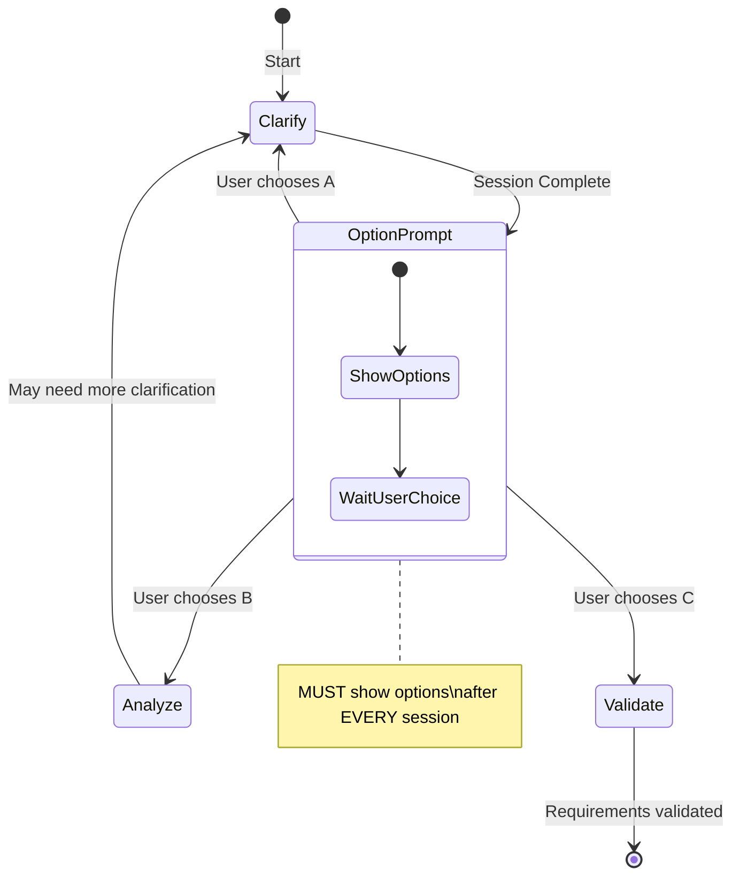

# Phase 4: Requirements Clarification

**Phase Objective**: Eliminate ambiguity through targeted questioning and document all clarification decisions.
**Time Allocation**: 15% of total effort
**Your Role**: Professional Requirements Analyst

---

## Quick Reference

| Aspect | Guideline |
|--------|-----------|
| Max Questions | 5 per session |
| Question Format | Multiple-choice (2-4 options) or Short phrase (<=5 words) |
| Delivery | ONE question at a time, wait for answer |
| Output Files | `04-clarification.md` (log) + update `03-analysis.md` |

---

## Output

**File**: `.kiro/specs/[feature-name]/04-clarification.md`
**Template**: See `template-clarification.md`

---

## Pre-Check (GATE CHECK)

**MUST pass this check before starting**:

- [ ] **Phase 3 completed?** Verify `03-analysis.md` exists with user stories and use cases
- [ ] **Ambiguities identified?** List requirements with `[NEEDS CLARIFICATION]` markers
- [ ] **Stakeholder available?** User can answer clarification questions

**If ANY check fails**: STOP. Return to Phase 3 or wait for stakeholder availability.

---

## Ambiguity Taxonomy (MUST SCAN)

Perform a structured ambiguity scan using this taxonomy:

### 1. Functional Scope & Behavior

| Check Point | Questions to Consider |
|-------------|----------------------|
| Core user goals | What defines success for the user? |
| Success criteria | How do we measure if the feature works? |
| Out-of-scope | What is explicitly NOT included? |
| User roles | Are all personas clearly differentiated? |

### 2. Domain & Data Model

| Check Point | Questions to Consider |
|-------------|----------------------|
| Entities & attributes | Are all data fields defined? |
| Identity & uniqueness | What makes each record unique? |
| Lifecycle/state | What states can entities transition through? |
| Data volume | What scale assumptions are we making? |

### 3. Interaction & UX Flow

| Check Point | Questions to Consider |
|-------------|----------------------|
| User journeys | Are critical paths fully documented? |
| Error states | What happens when things go wrong? |
| Empty states | What does the user see with no data? |
| Loading states | How is progress communicated? |

### 4. Non-Functional Quality Attributes

| Check Point | Questions to Consider |
|-------------|----------------------|
| Performance | Latency and throughput targets? |
| Scalability | Horizontal/vertical limits? |
| Reliability | Uptime and recovery requirements? |
| Security | Authentication and authorization rules? |
| Compliance | Regulatory constraints? |

### 5. Integration & External Dependencies

| Check Point | Questions to Consider |
|-------------|----------------------|
| External APIs | Which services? Failure modes? |
| Data formats | Import/export specifications? |
| Protocol versions | API versioning strategy? |

### 6. Edge Cases & Failure Handling

| Check Point | Questions to Consider |
|-------------|----------------------|
| Negative scenarios | What if user provides invalid input? |
| Rate limiting | How to handle abuse? |
| Concurrent edits | Conflict resolution strategy? |

### 7. Terminology & Consistency

| Check Point | Questions to Consider |
|-------------|----------------------|
| Glossary terms | Are key terms defined? |
| Synonyms | Are deprecated terms identified? |

---

## Execution Flow

### Step 1: Load and Analyze Specification

Read `03-analysis.md` and scan for ambiguities using the taxonomy above.

**Identify**:
- Vague terms: "user-friendly", "fast", "secure", "flexible"
- Missing details: "users can login" (which users? how?)
- Unclear scope: "manage products" (create/edit/delete/view?)
- Undefined conditions: "when needed", "if required"
- Placeholders: `[TBD]`, `[NEEDS CLARIFICATION]`

### Step 2: Generate Prioritized Questions

Create a prioritized queue of clarification questions (maximum 5):

**Question Constraints**:
- **Answerable**: Multiple-choice (2-4 options) OR Short phrase (<=5 words)
- **Impactful**: Must materially impact architecture, data model, UX, or compliance
- **Balanced**: Cover different categories from the taxonomy
- **Non-trivial**: Exclude already-answered or obvious questions

**Priority Order**:
1. Functional scope ambiguities (blocking)
2. Data model ambiguities (architectural impact)
3. Non-functional requirements (quality impact)
4. Edge cases (robustness impact)
5. Terminology (consistency impact)

### Step 3: Sequential Questioning (ONE AT A TIME)

**CRITICAL**: Present EXACTLY ONE question at a time. Wait for answer before next question.

#### Multiple-Choice Question Format

```markdown
**Question [N/Total]**: [Category]

[Complete question text]

**Recommended**: Option [X] - [Brief reason for recommendation]

**Options**:

> **A** - [Option A description]

> **B** - [Option B description]

> **C** - [Option C description]

> **Other** - Provide your own answer (<=5 words)

---
Reply with option letter (e.g., "A"), or "yes" to accept recommendation, or enter your custom answer.
```

#### Short-Answer Question Format

```markdown
**Question [N/Total]**: [Category]

[Complete question text]

**Suggested Answer**: [Your suggestion] - [Brief reason]

---
Enter your answer (<=5 words), or "yes" to accept suggestion.
```

### Step 4: Record Answers (MANDATORY)

**CRITICAL**: You MUST create and maintain a clarification log file. This is NON-NEGOTIABLE.

#### 4.1 Create Clarification Log (After First Answer)

**IMMEDIATELY after the FIRST question is answered**, create:

```
.kiro/specs/[feature-name]/04-clarification.md
```

#### 4.2 Update Log After EACH Answer

**After EACH question is answered, you MUST**:

1. **Append the Q&A record** to `04-clarification.md` immediately
2. **Update the Summary table** with the new entry
3. **Save the file** before asking the next question

#### 4.3 Apply Clarification to Analysis Document

After recording in `04-clarification.md`:

1. **Update `03-analysis.md`** with clarified requirements:
   - Functional ambiguity → User Stories / Use Cases
   - Data model → Domain Model section
   - Non-functional → Feasibility Assessment
   - Edge case → Alternative/Exception Flows

2. **Remove ambiguity markers**: Replace `[NEEDS CLARIFICATION]` with resolved content

3. **Add cross-reference** in both files

### Step 5: Stop Conditions

Stop asking questions when ANY of these apply:
- All critical ambiguities resolved
- User signals completion ("done", "enough", "no more")
- Reached 5 questions maximum
- Remaining ambiguities are non-blocking (can defer to implementation)

### Step 6: Validation

After each write, verify:
- [ ] Clarification recorded with complete details
- [ ] Analysis document updated
- [ ] No contradictory statements introduced
- [ ] Terminology consistent
- [ ] Total questions <= 5

### Step 7: Completion Report

**BEFORE reporting completion**, verify:
1. `04-clarification.md` has been created and saved
2. `03-analysis.md` has been updated
3. All questions and answers are recorded

**Output completion report**:

```markdown
## Clarification Complete

### Files Updated

| File | Path | Status |
|------|------|--------|
| Clarification Log | `.kiro/specs/[feature-name]/04-clarification.md` | CREATED |
| Analysis | `.kiro/specs/[feature-name]/03-analysis.md` | UPDATED |

### Session Summary

**Questions asked**: [N]
**Session date**: YYYY-MM-DD

### Questions & Answers

| # | Category | Question | Choice |
|---|----------|----------|--------|
| 1 | [Category] | [Brief question] | [Choice] |
| 2 | [Category] | [Brief question] | [Choice] |

### Coverage Summary

| Category | Status |
|----------|--------|
| Functional Scope | Resolved / Clear / Deferred |
| Domain & Data | Resolved / Clear / Deferred |
| Interaction & UX | Resolved / Clear / Deferred |
| Non-Functional | Resolved / Clear / Deferred |
| Integration | Resolved / Clear / Deferred |
| Edge Cases | Resolved / Clear / Deferred |
| Terminology | Resolved / Clear / Deferred |

**Status Legend**:
- **Resolved**: Was ambiguous, now clarified
- **Clear**: Already sufficient in analysis
- **Deferred**: Non-blocking, can resolve during implementation

### Next Steps Available

Based on the clarification results, you can choose one of the following:

| Option | Command | When to Choose |
|--------|---------|----------------|
| **A** | **Clarify** (Continue) | Deferred items need resolution, or new ambiguities found |
| **B** | **Analyze** (Re-analyze) | Significant changes require updating analysis document |
| **C** | **Validate** (Proceed) | All critical ambiguities resolved, ready for validation |

### Recommendation

[Based on coverage summary, recommend Option A/B/C with reason]

---
**Reply with A, B, or C to proceed, or describe what you'd like to do next.**
```

---

## Behavior Rules

- **No ambiguities found**: "No critical ambiguities detected. Recommend proceeding to Phase 5: Validate."
- **Analysis file missing**: "Please complete Phase 3: Analyze first."
- **Never exceed 5 questions**: Prioritize most impactful ambiguities
- **Respect user signals**: Stop immediately if user says "done" or "enough"
- **Avoid speculation**: Don't ask about tech stack unless it blocks functional clarity

---

## Exit Criteria (NON-NEGOTIABLE)

| Criteria | Standard | Verification | Status |
|----------|----------|--------------|--------|
| Clarification Log | `04-clarification.md` created | File exists | [ ] |
| All Q&A Recorded | Complete details for each question | Review log | [ ] |
| Analysis Updated | Clarifications applied to `03-analysis.md` | Cross-reference | [ ] |
| No Contradictions | Consistent statements | Review both files | [ ] |
| Max 5 Questions | Question count <= 5 | Count in log | [ ] |

---

## Next Step (MUST PROMPT USER)

**CRITICAL**: After EVERY clarification session, you MUST present the following options to the user:

```markdown
---
## Clarification Session Complete

**What would you like to do next?**

| Option | Action | Description |
|--------|--------|-------------|
| **A** | **Clarify** | Continue clarification - resolve deferred items or new ambiguities |
| **B** | **Analyze** | Return to Analysis - update 03-analysis.md with clarification results |
| **C** | **Validate** | Proceed to Validation - verify requirements through 5 dimensions |

**Recommendation**: [Your recommendation based on session results]

---
Reply with **A**, **B**, or **C**, or describe what you'd like to do.
```

### When to Recommend Each Option

| Recommend | Condition |
|-----------|-----------|
| **A (Clarify)** | >2 items deferred, or user mentioned new unclear areas |
| **B (Analyze)** | Major scope changes, new user stories needed, or analysis outdated |
| **C (Validate)** | All critical ambiguities resolved, coverage summary shows mostly "Resolved" or "Clear" |

### Option Flows


