# Phase 5: Requirements Validation

**Phase Objective**: Validate requirements through 5 critical dimensions to ensure they are ready for implementation.
**Time Allocation**: 15% of total effort
**Your Role**: Professional Requirements Analyst

---

## Quick Reference

| Validation Dimension | Focus | Key Question |
|---------------------|-------|--------------|
| **Authenticity** | Real need | Is this a genuine user/business need? |
| **Completeness** | Coverage | Are all aspects fully specified? |
| **Consistency** | Coherence | Are requirements conflict-free? |
| **Feasibility** | Achievability | Is it technically and economically viable? |
| **Verifiability** | Testability | Can we objectively verify it's met? |

---

## Output

**File**: `.kiro/specs/[feature-name]/validation.md`

> **Dependencies**: See `POWER.md` → File Dependencies for required template and helper files.

---

## The 5 Validation Dimensions (CORE FRAMEWORK)

```mermaid
graph TB
    subgraph ValidationFramework["Requirements Validation Framework"]
        direction TB
        V1[/"🎯 Authenticity<br/>真实性"/]
        V2[/"📋 Completeness<br/>完整性"/]
        V3[/"🔗 Consistency<br/>一致性"/]
        V4[/"⚖️ Feasibility<br/>可行性"/]
        V5[/"✅ Verifiability<br/>可验证性"/]
    end

    REQ[Requirements] --> V1
    V1 --> V2
    V2 --> V3
    V3 --> V4
    V4 --> V5
    V5 --> VALID[Validated Requirements]

    style V1 fill:#e1f5fe,stroke:#01579b
    style V2 fill:#e1f5fe,stroke:#01579b
    style V3 fill:#e1f5fe,stroke:#01579b
    style V4 fill:#fff3e0,stroke:#e65100
    style V5 fill:#e8f5e9,stroke:#1b5e20
```



---

## MANDATORY: Multi-Role Validation

Requirements MUST be validated from 5 role perspectives (see `helper-multi-role-validation.md`):
- **Product Manager (PM)**: Business value, user need, strategic alignment
- **Requirements Analyst (RA)**: Completeness, clarity, traceability
- **Software Architect (SA)**: Technical feasibility, architecture impact, NFRs
- **Software Engineer (SE)**: Implementation clarity, effort estimation, error handling
- **Test Engineer (TE)**: Testability, acceptance criteria, test coverage

---

## Pre-Check (GATE CHECK)

**MUST pass this check before starting**:

- [ ] **Phase 4 completed?** Verify `clarification.md` exists with resolved ambiguities
- [ ] **Requirements documented?** All requirements in `requirements.md` are clarified
- [ ] **Stakeholders available?** Reviewers from different roles identified

**If ANY check fails**: STOP. Return to Phase 4.

---

## Dimension 1: Authenticity Validation (真实性验证)

### Purpose

Verify that requirements represent **genuine user needs** and **real business problems**, not assumptions or "nice-to-haves".

### Validation Criteria

| Criterion | Question | Evidence Required |
|-----------|----------|-------------------|
| **User Origin** | Did this come from actual users? | User interviews, feedback logs |
| **Problem Evidence** | Is there proof the problem exists? | Support tickets, user complaints, analytics |
| **Business Alignment** | Does it support business goals? | Business case, strategic plan link |
| **Stakeholder Confirmation** | Have stakeholders validated this need? | Sign-off, meeting minutes |
| **Usage Frequency** | How often will this be used? | Usage projections, market data |

### Authenticity Checklist

```markdown
## Authenticity Validation Checklist

### Source Verification
- [ ] Requirement traced to specific user/stakeholder request
- [ ] Original request documented (interview, ticket, email)
- [ ] Not based solely on assumptions or competitor features

### Problem Validation
- [ ] Problem statement clearly articulated
- [ ] Evidence of problem exists (metrics, complaints, observations)
- [ ] Impact of NOT solving this problem quantified

### Stakeholder Validation
- [ ] Business sponsor confirmed the need
- [ ] End users confirmed this solves their problem
- [ ] No stakeholder objections recorded

### Business Value
- [ ] Clear business benefit articulated
- [ ] ROI or value proposition defined
- [ ] Aligned with product strategy/roadmap
```

### Red Flags (Authenticity Issues)

| Red Flag | Description | Action |
|----------|-------------|--------|
| 🚩 "Users might want..." | Assumption without evidence | Conduct user research |
| 🚩 "Competitor has it" | Feature copying without validation | Validate with YOUR users |
| 🚩 No stakeholder source | Origin unclear | Trace back to source |
| 🚩 "Future-proofing" | Speculative requirement | Defer or validate need |

---

## Dimension 2: Completeness Validation (完整性验证)

### Purpose

Ensure requirements are **fully specified** with no missing information, gaps, or TBDs.

### Completeness Model


### Completeness Checklist

```markdown
## Completeness Validation Checklist

### Functional Coverage
- [ ] All user roles/personas covered
- [ ] All CRUD operations specified (if applicable)
- [ ] All business rules documented
- [ ] All decision points have defined outcomes

### Data Coverage
- [ ] All data entities defined
- [ ] All attributes specified with types
- [ ] All relationships documented
- [ ] Data validation rules complete
- [ ] Data lifecycle (create, update, archive, delete) defined

### Flow Coverage
- [ ] Main success scenarios documented
- [ ] Alternative flows identified
- [ ] Entry and exit points clear
- [ ] Handoffs between actors/systems defined

### State Coverage
- [ ] All possible states identified
- [ ] State transitions defined
- [ ] Transition triggers specified
- [ ] Invalid state transitions documented

### Error Coverage
- [ ] Error conditions identified
- [ ] Error messages specified
- [ ] Recovery procedures defined
- [ ] Error escalation paths documented

### Non-Functional Coverage
- [ ] Performance requirements quantified
- [ ] Security requirements specified
- [ ] Scalability requirements defined
- [ ] Availability requirements documented
- [ ] Compliance requirements listed
```

### Completeness Metrics

| Category | Total Items | Specified | Complete (%) | Target |
|----------|-------------|-----------|--------------|--------|
| Functional | [N] | [N] | [%] | ≥95% |
| Data | [N] | [N] | [%] | ≥95% |
| Flows | [N] | [N] | [%] | ≥90% |
| States | [N] | [N] | [%] | ≥90% |
| Errors | [N] | [N] | [%] | ≥85% |
| NFRs | [N] | [N] | [%] | ≥90% |

---

## Dimension 3: Consistency Validation (一致性验证)

### Purpose

Ensure requirements are **internally coherent** with no conflicts, contradictions, or ambiguous overlaps.

### Consistency Types

| Type | Description | Example |
|------|-------------|---------|
| **Internal** | No conflicts within same requirement | Field is both "required" and "optional" |
| **Inter-requirement** | No conflicts between requirements | REQ-1 says A, REQ-2 says NOT A |
| **Terminology** | Same term means same thing everywhere | "User" vs "Customer" vs "Client" |
| **Data** | Data definitions consistent | Field length differs in different places |
| **Temporal** | No timeline conflicts | Deadline A before deadline B, but B is prerequisite |

### Consistency Checklist

```markdown
## Consistency Validation Checklist

### Terminology Consistency
- [ ] Glossary defined and maintained
- [ ] Same concepts use same terms
- [ ] No synonyms used interchangeably
- [ ] Acronyms expanded on first use

### Data Consistency
- [ ] Field names consistent across requirements
- [ ] Data types consistent for same fields
- [ ] Validation rules consistent
- [ ] Format specifications consistent (dates, numbers, etc.)

### Logic Consistency
- [ ] No contradictory business rules
- [ ] No conflicting conditions
- [ ] Priority order logical (no circular dependencies)
- [ ] Precedence rules clear when conflicts possible

### Reference Consistency
- [ ] Cross-references valid and up-to-date
- [ ] No orphan requirements (unreferenced)
- [ ] No broken links to design/test documents
- [ ] Version references consistent
```

### Conflict Detection Matrix

| Req A | Req B | Conflict Type | Resolution |
|-------|-------|---------------|------------|
| REQ-001 | REQ-005 | [Type] | [How resolved] |
| REQ-003 | REQ-007 | [Type] | [How resolved] |

---

## Dimension 4: Feasibility Validation (可行性验证)

### Purpose

Validate that requirements are **achievable** from technical, economic, operational, and schedule perspectives.

### Feasibility Dimensions

```mermaid
graph TB
    subgraph FeasibilityTypes["Comprehensive Feasibility Assessment"]
        direction TB
        TF["🔧 Technical Feasibility<br/>技术可行性"]
        EF["💰 Economic Feasibility<br/>经济可行性"]
        OF["⚙️ Operational Feasibility<br/>运营可行性"]
        SF["📅 Schedule Feasibility<br/>时间可行性"]
        LF["⚖️ Legal/Compliance<br/>合规可行性"]
    end

    style TF fill:#e1f5fe,stroke:#01579b
    style EF fill:#e8f5e9,stroke:#1b5e20
    style OF fill:#fff3e0,stroke:#e65100
    style SF fill:#f3e5f5,stroke:#4a148c
    style LF fill:#ffebee,stroke:#b71c1c
```



### 4.1 Technical Feasibility (技术可行性)

| Assessment Area | Questions | Rating |
|-----------------|-----------|--------|
| **Technology Maturity** | Is the required technology proven? | High/Medium/Low |
| **Team Capability** | Does team have required skills? | High/Medium/Low |
| **Architecture Fit** | Compatible with existing architecture? | High/Medium/Low |
| **Integration Complexity** | Can we integrate with required systems? | High/Medium/Low |
| **Performance Achievability** | Can we meet performance requirements? | High/Medium/Low |
| **Security Implementation** | Can we implement security requirements? | High/Medium/Low |

### 4.2 Economic Feasibility (经济可行性)

```markdown
## Economic Feasibility Analysis

### Development Costs
| Cost Category | Estimate | Confidence |
|---------------|----------|------------|
| Development effort | [Person-months] | High/Medium/Low |
| Infrastructure | [Cost] | High/Medium/Low |
| Third-party licenses | [Cost] | High/Medium/Low |
| External services | [Cost] | High/Medium/Low |
| **Total Development** | **[Sum]** | |

### Operational Costs (Annual)
| Cost Category | Estimate | Confidence |
|---------------|----------|------------|
| Hosting/Infrastructure | [Cost] | High/Medium/Low |
| Maintenance | [Cost] | High/Medium/Low |
| Support | [Cost] | High/Medium/Low |
| Third-party fees | [Cost] | High/Medium/Low |
| **Total Operational** | **[Sum]** | |

### Benefit Analysis
| Benefit Category | Estimate | Timeframe |
|------------------|----------|-----------|
| Revenue increase | [Amount] | [Period] |
| Cost reduction | [Amount] | [Period] |
| Efficiency gain | [Amount] | [Period] |
| Risk mitigation | [Value] | [Period] |
| **Total Benefit** | **[Sum]** | |

### ROI Calculation
- **Total Investment**: [Development + Year 1 Operational]
- **Annual Benefit**: [Total Benefit]
- **Payback Period**: [Months/Years]
- **3-Year ROI**: [Percentage]

### Economic Decision
- [ ] ✅ Economically viable (ROI meets threshold)
- [ ] ⚠️ Marginal (requires further analysis)
- [ ] ❌ Not viable (costs exceed benefits)
```

### 4.3 Operational Feasibility (运营可行性)

| Assessment Area | Questions | Status |
|-----------------|-----------|--------|
| **Process Impact** | How will this change existing processes? | [Assessment] |
| **Training Required** | What training is needed? | [Hours/Cost] |
| **Change Management** | How disruptive is this change? | High/Medium/Low |
| **Support Capability** | Can support team handle this? | Yes/Needs Scaling |
| **Data Migration** | Is data migration required? | [Scope/Risk] |

### 4.4 Schedule Feasibility (时间可行性)

| Milestone | Required Date | Achievable Date | Gap | Risk |
|-----------|---------------|-----------------|-----|------|
| Design Complete | [Date] | [Date] | [Days] | High/Medium/Low |
| Development Complete | [Date] | [Date] | [Days] | High/Medium/Low |
| Testing Complete | [Date] | [Date] | [Days] | High/Medium/Low |
| Release | [Date] | [Date] | [Days] | High/Medium/Low |

### 4.5 Legal/Compliance Feasibility (合规可行性)

| Requirement | Regulation | Compliance Status | Gap |
|-------------|------------|-------------------|-----|
| Data Privacy | GDPR/CCPA | Compliant/Gap | [Description] |
| Accessibility | WCAG 2.1 | Compliant/Gap | [Description] |
| Industry Specific | [Regulation] | Compliant/Gap | [Description] |

### Feasibility Summary

| Dimension | Rating | Risk Level | Blocking Issues |
|-----------|--------|------------|-----------------|
| Technical | High/Medium/Low | High/Medium/Low | [Count] |
| Economic | Viable/Marginal/Not Viable | High/Medium/Low | [Count] |
| Operational | High/Medium/Low | High/Medium/Low | [Count] |
| Schedule | Achievable/At Risk/Not Achievable | High/Medium/Low | [Count] |
| Legal/Compliance | Compliant/Gaps/Non-compliant | High/Medium/Low | [Count] |

---

## Dimension 5: Verifiability Validation (可验证性验证)

### Purpose

Ensure every requirement can be **objectively verified** through testing, measurement, or inspection.

### Verifiability Criteria

| Criterion | Description | Example |
|-----------|-------------|---------|
| **Measurable** | Has quantifiable target | "Response time < 2 seconds" |
| **Observable** | Can see/detect outcome | "Button changes to green" |
| **Testable** | Can create test case | Clear pass/fail criteria |
| **Demonstrable** | Can show to stakeholder | Working prototype possible |

### 5.1 Vague Terms Check (MANDATORY)

**Scan ALL requirements** for ambiguous terms that prevent objective verification.

| Category | Vague Terms to Detect | Quantified Alternative |
|----------|----------------------|------------------------|
| **Performance** | fast, quick, responsive, efficient | "< 2s response time", "95th percentile < 500ms" |
| **Usability** | user-friendly, easy, intuitive, simple | "Task completion rate > 90%", "< 3 clicks" |
| **Quality** | reliable, stable, robust, secure, safe | "99.9% uptime", "OWASP Top 10 compliant" |
| **Flexibility** | flexible, configurable, extensible | "Supports N configuration options" |
| **Scale** | scalable, many, few, large, small | "10,000 concurrent users", "1TB storage" |

**Action Required**: For each vague term found, provide quantified replacement recommendation.

### 5.2 Non-Quantified Standards Check (MANDATORY)

**Scan ALL requirements** for standards lacking measurable metrics.

| Standard Type | Non-Quantified Example | Quantified Example |
|---------------|------------------------|-------------------|
| **Time** | "fast loading", "quick response" | "Page load < 3s on 4G", "API response < 200ms" |
| **Capacity** | "support many users", "handle large data" | "10,000 concurrent users", "100GB dataset" |
| **Availability** | "high availability", "always available" | "99.9% uptime", "RTO < 1 hour" |
| **Quality** | "low error rate", "high accuracy" | "Error rate < 0.1%", "Accuracy > 95%" |
| **Performance** | "good throughput", "low latency" | "1000 TPS", "P99 latency < 100ms" |

**Action Required**: For each non-quantified standard, specify measurable metric with threshold.

### Verifiability Checklist

```markdown
## Verifiability Validation Checklist

### Quantification
- [ ] Performance requirements have numeric targets
- [ ] Capacity requirements have specific limits
- [ ] Quality requirements have measurable thresholds
- [ ] No vague terms like "fast", "user-friendly", "secure"

### Test Design
- [ ] Each requirement has at least one test case design
- [ ] Acceptance criteria in Given-When-Then format
- [ ] Edge cases identified with test scenarios
- [ ] Negative test cases designed

### Verification Method
- [ ] Verification method specified for each requirement
  - [ ] Test (automated/manual)
  - [ ] Inspection (code review, document review)
  - [ ] Analysis (calculation, simulation)
  - [ ] Demonstration (prototype, live demo)

### Acceptance Criteria
- [ ] Every requirement has acceptance criteria
- [ ] Criteria are specific and unambiguous
- [ ] Criteria are achievable (not impossible to meet)
- [ ] Criteria are independent (not relying on uncontrolled factors)
```

### GWT Acceptance Criteria Format

```gherkin
## Requirement: [REQ-ID] [Requirement Name]

### AC-1: [Scenario Name]
Given [precondition/context]
  And [additional precondition]
When [action/trigger]
Then [expected outcome]
  And [additional outcome with measurable criteria]

### AC-2: [Error Scenario]
Given [precondition]
When [error condition]
Then [error handling behavior]
  And [user notification with specific message]
```

### Verification Matrix

| Req ID | Verification Method | Test Cases | Acceptance Criteria | Status |
|--------|---------------------|------------|---------------------|--------|
| REQ-001 | Test | TC-001~003 | AC-001~003 | ✅ Verifiable |
| REQ-002 | Demonstration | Demo-001 | AC-004~005 | ✅ Verifiable |
| REQ-003 | Inspection | Review-001 | AC-006 | ⚠️ Needs refinement |

---

## Validation Process Flow


---

## Validation Report Output

### Report Structure Overview

The validation report includes:

1. **Executive Summary** - Overall validation status
2. **Dimension Summary Table** - Quick overview of all 5 dimensions
3. **Validation Radar Chart** - Visual representation of scores (radar chart + progress bars)
4. **Detailed Score Justification** - For each dimension:
   - Score calculation formula
   - Positive findings (why score is this high)
   - Negative findings (why score is not higher)
   - Verdict (2-3 sentence explanation)
5. **Multi-Role Validation** - Sign-off matrix from 5 role perspectives
6. **Traceability Matrix** - Requirements to test case mapping
7. **Outstanding Issues** - Unresolved items with severity and owner
8. **Sign-Off** - Stakeholder approvals

### Score Justification Requirements

**CRITICAL**: Every dimension score MUST include:

| Requirement | Description |
|-------------|-------------|
| **Score Calculation** | Formula showing how percentage was derived |
| **Positive Findings** | Evidence table explaining why score is this high |
| **Negative Findings** | Issues table explaining why score is not higher |
| **Verdict** | 2-3 sentences summarizing the score justification |

### Radar Chart Requirements

The radar chart section MUST include:
- Mermaid `radar-beta` radar chart with 80% threshold curve
- Progress bar visualization table
- Analysis summary (average, highest, lowest, balance)
- Key insight (1-2 sentences)

---

## Exit Criteria (NON-NEGOTIABLE)

| Criterion | Standard | Verification | Status |
|----------|----------|--------------|--------|
| **Authenticity** | All P0/P1 requirements have documented origin | Source traced | [ ] |
| **Completeness** | ≥95% functional, ≥90% NFR coverage | Checklist complete | [ ] |
| **Consistency** | Zero unresolved conflicts | Conflict matrix clear | [ ] |
| **Feasibility** | All dimensions assessed, no blockers | Assessment complete | [ ] |
| **Verifiability** | 100% P0 requirements have GWT | Test design exists | [ ] |
| **Multi-Role Review** | 5 role perspectives applied | Checklist complete | [ ] |
| **Sign-Off** | Key stakeholders approved | Signatures obtained | [ ] |

**CRITICAL**: NEVER mark validation complete if critical issues remain unresolved.

---

## Next Step (MUST PROMPT USER)

**CRITICAL**: After EVERY validation session, you MUST present the following options to the user:

```markdown
---
## Validation Session Complete

### Validation Result Summary

| Dimension | Score | Status | Issues |
|-----------|-------|--------|--------|
| Authenticity | [X]% | ✅/⚠️/❌ | [Count] |
| Completeness | [X]% | ✅/⚠️/❌ | [Count] |
| Consistency | [X]% | ✅/⚠️/❌ | [Count] |
| Feasibility | [X]% | ✅/⚠️/❌ | [Count] |
| Verifiability | [X]% | ✅/⚠️/❌ | [Count] |

**Overall Status**: [PASS / FAIL]

---

**What would you like to do next?**

| Option | Action | Description |
|--------|--------|-------------|
| **A** | **Specify** | Proceed to Specification - write PRD, API spec, BDD, RTM |
| **B** | **Validate** | Continue Validation - address remaining issues or re-validate |
| **C** | **Clarify** | Return to Clarification - resolve ambiguities causing validation failures |
| **D** | **Analyze** | Return to Analysis - update requirements based on validation findings |

**Recommendation**: [Your recommendation based on validation results]

**Reason**: [Why this recommendation - reference specific failed dimensions/issues]

---
Reply with **A**, **B**, **C**, or **D**, or describe what you'd like to do.
```

### When to Recommend Each Option

| Recommend | Condition | Typical Failed Dimensions |
|-----------|-----------|---------------------------|
| **A (Specify)** | All 5 dimensions ≥80%, no critical issues | None |
| **B (Validate)** | Minor issues remain, need to verify fixes | Any with minor issues |
| **C (Clarify)** | Ambiguities, unclear requirements, stakeholder input needed | Authenticity, Completeness (unclear parts) |
| **D (Analyze)** | Major gaps in requirements, need restructuring or new requirements | Completeness (missing), Consistency, Feasibility |

### Validation Failure Routing Guide

| Failed Dimension | Primary Issue | Recommended Action |
|------------------|---------------|-------------------|
| **Authenticity** | Unverified user needs | **C (Clarify)** - Need stakeholder confirmation |
| **Completeness** | Missing requirements | **D (Analyze)** - Need to add/expand requirements |
| **Completeness** | Unclear specifications | **C (Clarify)** - Need to resolve ambiguities |
| **Consistency** | Conflicting requirements | **D (Analyze)** - Need to restructure/resolve conflicts |
| **Feasibility** | Technical blockers | **D (Analyze)** - Need to redesign approach |
| **Feasibility** | Resource/schedule issues | **C (Clarify)** - Need stakeholder input on scope |
| **Verifiability** | Missing acceptance criteria | **C (Clarify)** - Need to define test criteria |

### Option Flows

```mermaid
stateDiagram-v2
    [*] --> Validate: Start

    Validate --> OptionPrompt: Session Complete

    state OptionPrompt {
        [*] --> EvaluateResults
        EvaluateResults --> ShowOptions
        ShowOptions --> WaitUserChoice
    }

    OptionPrompt --> Specify: A (All Pass)
    OptionPrompt --> Validate: B (Minor Issues)
    OptionPrompt --> Clarify: C (Ambiguities)
    OptionPrompt --> Analyze: D (Major Gaps)

    Clarify --> Validate: After clarification
    Analyze --> Clarify: After analysis update
    Analyze --> Validate: Direct re-validation
    Specify --> [*]: Requirements specified

    note right of OptionPrompt: MUST show options\nafter EVERY session
    note left of Analyze: Return here for:\n- Missing requirements\n- Conflicts\n- Feasibility issues
    note left of Clarify: Return here for:\n- Ambiguities\n- Stakeholder input\n- Acceptance criteria
```
