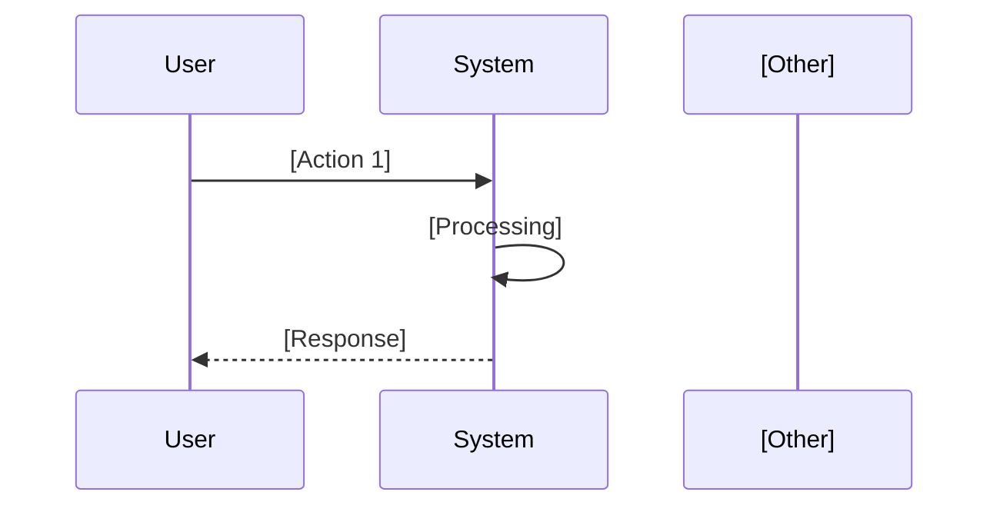
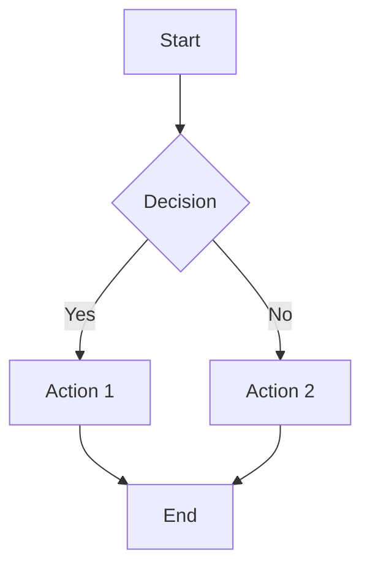

# Product Steering Template

Use this template for `.kiro/steering/product.md`.

---

# Product Steering

## Vision

[What is the product and why does it exist? 1-2 sentences describing the core purpose.]

## Target Users

[Who are the primary users? List personas or user types.]

- **[Persona 1]**: [Description and needs]
- **[Persona 2]**: [Description and needs]

## Business Constraints

[What business rules or limitations must be respected?]

- [Constraint 1]
- [Constraint 2]
- [Constraint 3]

## Success Metrics

[How do we measure success? Include specific, measurable targets.]

- **[Metric 1]**: [Target value]
- **[Metric 2]**: [Target value]
- **[Metric 3]**: [Target value]

## Non-Functional Requirements

### Performance
- [Performance requirement 1]
- [Performance requirement 2]

### Security
- [Security requirement 1]
- [Security requirement 2]

### Compliance
- [Compliance requirement if applicable]

## Core Business Flows

<!--
  Document the key business processes of the system.
  Use Mermaid flowcharts or sequence diagrams for clarity.
  Focus on user-facing workflows and critical business operations.
-->

### Flow 1: [Primary Business Flow Name]

**Description**: [Brief description of what this flow accomplishes]

**Actors**: [Who participates in this flow]

### Flow 2: [Secondary Business Flow Name]

**Description**: [Brief description]

### Business Flow Inventory

| Flow ID | Name | Description | Frequency | Criticality |
|---------|------|-------------|-----------|-------------|
| BF-001 | [Flow Name] | [Brief description] | [Daily/Weekly/etc.] | [High/Medium/Low] |
| BF-002 | [Flow Name] | [Brief description] | [Frequency] | [Criticality] |

## Feature Prioritization

[Guidelines for prioritizing features]

- **P1 (Must Have)**: [Criteria]
- **P2 (Should Have)**: [Criteria]
- **P3 (Nice to Have)**: [Criteria]
